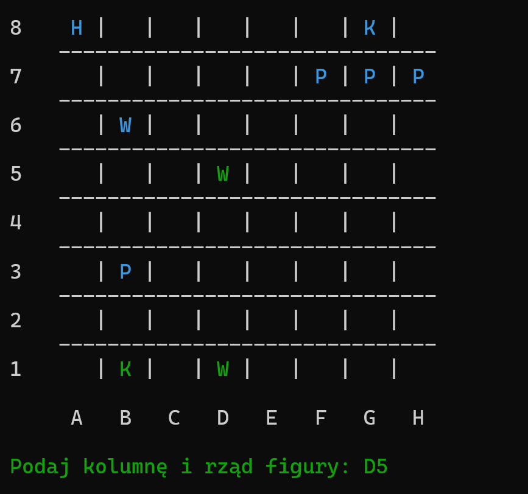

# Chess Engine

This is a chess engine written in C using mini-max algorithm.

## Features

- Renders the chess board in the console.
- Generates legal moves for each chess piece.
- Checks if there is a check, pat and mate.
- Uses mini-max algorithm and board evaluation function.
- Manages a game between a player and bot.

## Installation

To install the program, follow these steps:

1. Clone or download the repository.
2. Run the chess executable.

## How to make a move
To make a move, type the column and row of the chess board to select a pawn. From the allowed legal moves, type the column and row of the chess board to make a move.

## Known Issues

- None at this time.

## Contact

If you have any questions or feedback, please contact me at krabczewski@gmail.com.
